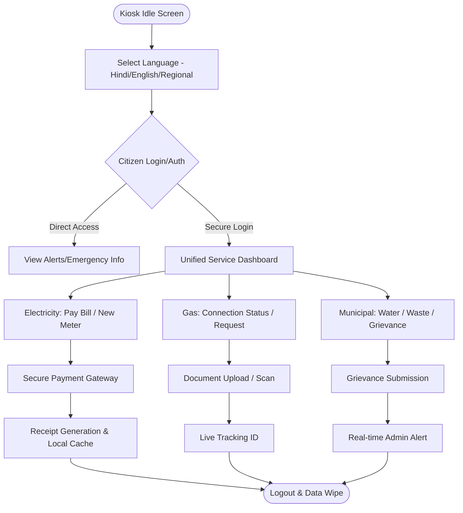
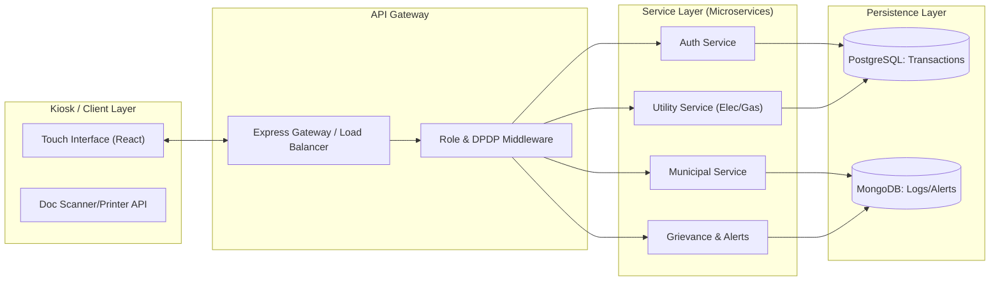
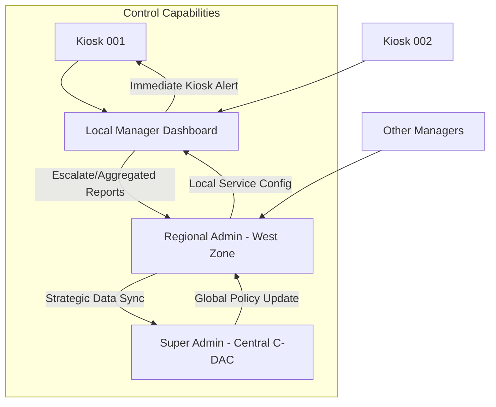
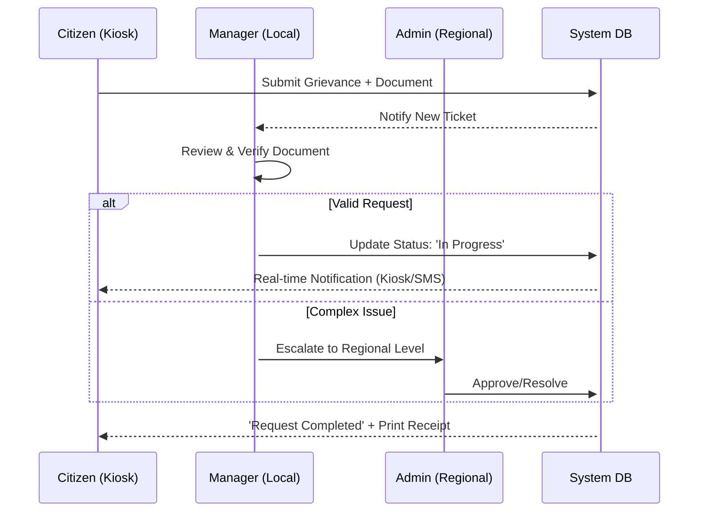
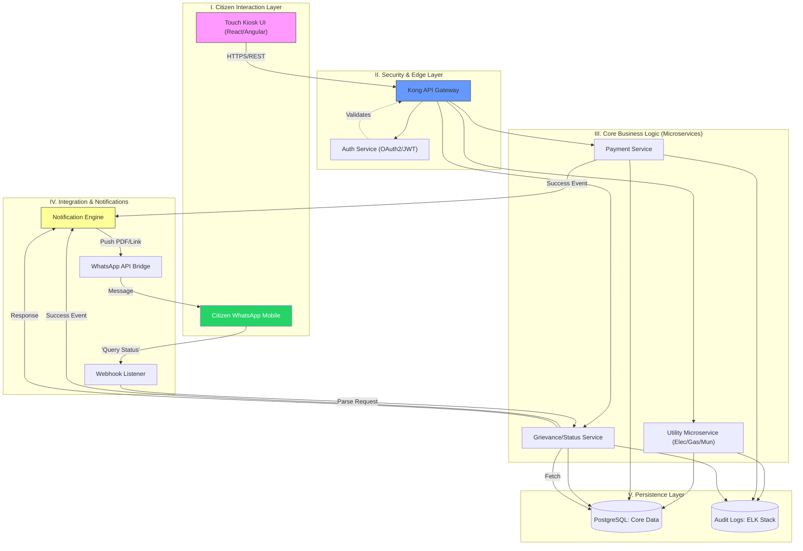

# SUVIDHA System Flowcharts & Interaction Models

## 1. Unified Kiosk User Experience (CX) Flow
This flowchart describes the citizen's journey from language selection to service completion.

---

## 2. Microservices Backend Architecture
Detailed view of how loosely coupled services communicate via a Shared API Gateway.

---

## 3. Administrative & Monitoring Hierarchy
Flow of data from local Kiosks to Regional and Central Admins.

---

## 4. Grievance Redressal Lifecycle
How service requests are handled across the hierarchy.

## 5. System Security & Compliance
Detailed view of security measures and compliance protocols.

