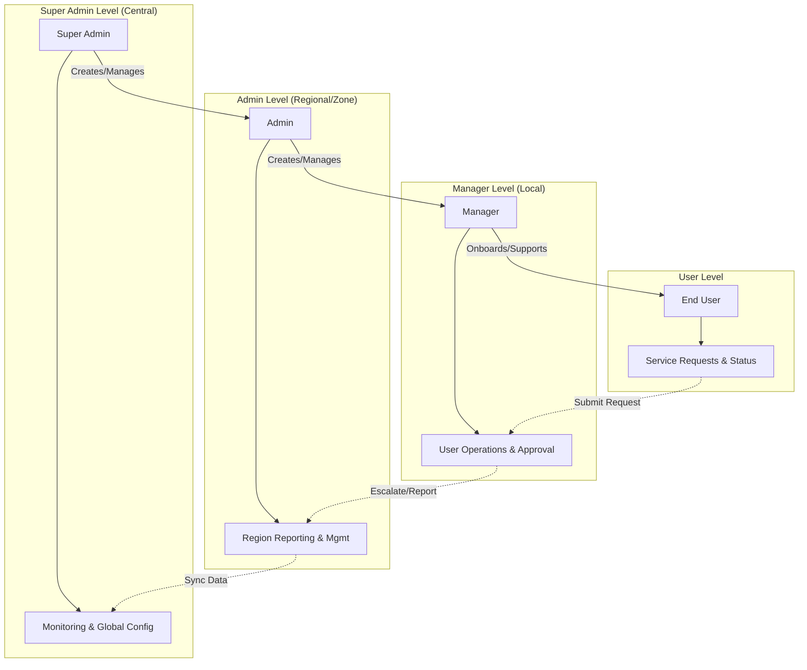
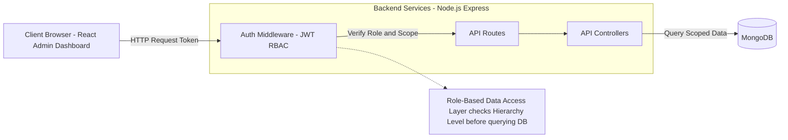
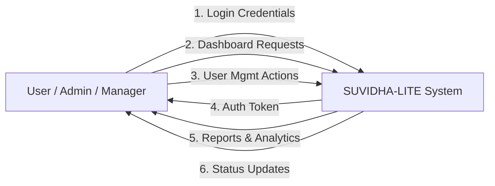
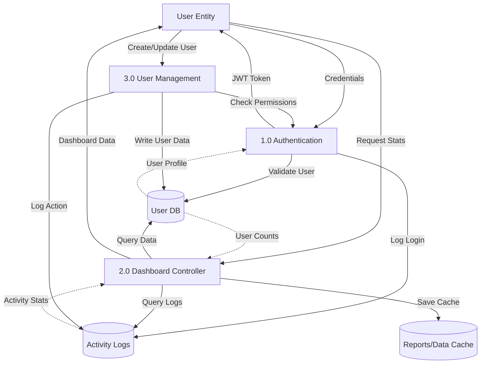

# System Architecture & Hierarchy Flowcharts

## 1. Hierarchical User Role Structure
This flowchart illustrates the levels of access and control within the Suvidha-Lite+ Dashboard.

## 2. Backend System Architecture
This diagram shows how the Technical Architecture supports the hierarchy.

## 3. Data Flow Diagrams (DFD)

### Level 0: Context Diagram
This diagram represents the interaction between valid Users and the System.

### Level 1: Data Flow Breakdown
This diagram details the flow of data through the internal processes and data stores.

