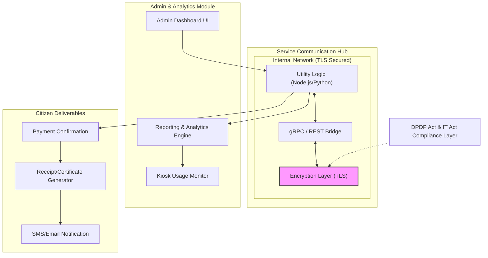

# SUVIDHA System Architecture Diagrams

## 1. High-Level System Overview
```mermaid
graph TB
    subgraph "Citizen Interaction Layer (Kiosk)"
        UI["Touch-Optimized Frontend (React/Angular)"] 
        ML["Multilingual Engine (Hindi/English/Regional)"]
        AUTH["Secure Auth (Biometric/OTP/JWT)"]
    end

    subgraph "API Management & Security Gateway"
        AGW["API Gateway (Nginx/Kong)"]
        SEC["OAuth2 / JWT Provider"]
        LSB["Load Balancer"]
    end

    subgraph "Core Microservices (Loosely Coupled)"
        direction LR
        E_SVC["Electricity Service"]
        G_SVC["Gas Utility Service"]
        M_SVC["Municipal Service (Water/Waste)"]
        P_SVC["Secure Payment Gateway"]
        D_SVC["Document & Receipt Service"]
    end

    subgraph "Persistence & External Layer"
        MDB [("Primary Database (PostgreSQL)")]
        LOG [("Interaction Logs (MySQL)")]
        EXT_PG["External Payment Aggregators"]
    end

    %% Connections
    UI <--> ML
    UI <--> AUTH
    AUTH --> AGW
    AGW <--> SEC
    AGW --> LSB
    LSB --> E_SVC
    LSB --> G_SVC
    LSB --> M_SVC
    LSB --> P_SVC
    LSB --> D_SVC

    E_SVC & G_SVC & M_SVC & P_SVC & D_SVC <--> MDB
    P_SVC <--> EXT_PG
    D_SVC --> LOG
```

## 2. Service Communication Hub & Governance

